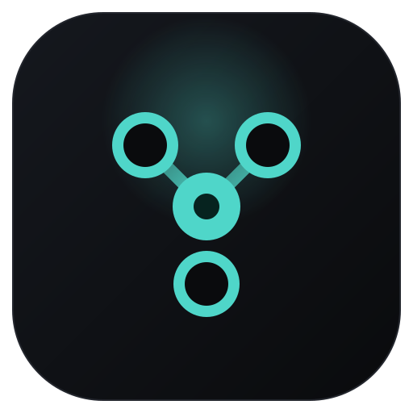

<div align="center">



# Orkai

**Workspace visual open-source para orquestração de agentes de IA.**

Um canvas infinito onde terminais, notas e agentes de CLI são nós que você conecta.
A aresta não é enfeite — ela é a permissão.

<a href="https://github.com/lucasmarujo/orkai/releases/latest">
  
</a>

<br>
<br>

[](LICENSE.md)
[](#requisitos)
[](https://tauri.app)
[](https://rustup.rs)
[](https://react.dev)

</div>

---

## O que é

Ferramentas de agente hoje escondem quem fala com quem atrás de arquivos de config. O Orkai
põe isso na tela: cada agente, terminal ou nota é um nó, e a conexão que você desenha é o
canal por onde eles se comunicam.

**A aresta no canvas é a ACL.** Um agente só lê e conversa com os nós ligados a ele. Não há
permissão implícita — se não tem fio, não tem acesso.

### Destaques

| | |
|---|---|
| **Canvas infinito** | Terminais, notas e agentes como nós arrastáveis. Zoom, marquise, grupos e ímã de alinhamento. |
| **Servidor MCP embutido** | Cada agente ganha ferramentas para listar peers, trocar mensagens, ler a caixa de entrada e ver o terminal do vizinho. |
| **Modo Maestro** | Liga um orquestrador a vários workers e acompanha a delegação acontecendo. |
| **Debugger visual de MCP** | Toda chamada entre agentes aparece na tela — dá pra ver a conversa, não só o resultado. |
| **Workflows por projeto** | Cada workflow aponta pra uma pasta. Troque de contexto sem matar os processos que já estão rodando. |
| **Terminais de verdade** | ConPTY nativo, não emulação. `xterm.js` com renderer WebGL. |

Estado atual: **M4 — colaboração entre agentes**, construído sobre o M3 (agentes de CLI como nós).

## Instalação

Baixe o instalador mais recente na
**[página de releases](https://github.com/lucasmarujo/orkai/releases/latest)**:

| Arquivo | Quando usar |
|---|---|
| `Orkai_x.y.z_x64_en-US.msi` | Instalação padrão, para toda a máquina. Pede admin. |
| `Orkai_x.y.z_x64-setup.exe` | Instalador NSIS, por usuário. Não pede admin. |

O binário não é assinado, então o SmartScreen vai avisar na primeira execução —
**Mais informações → Executar assim mesmo**.

## Requisitos

Para **usar**, basta Windows 10/11 com WebView2 (já vem no Windows 11).

Para **compilar**:

- [Rust](https://rustup.rs) com toolchain MSVC
- Visual Studio Build Tools 2022, workload **Desenvolvimento para desktop com C++**
- Node.js 22+

## Rodando do código-fonte

```powershell
git clone https://github.com/lucasmarujo/orkai.git
cd orkai
npm install
npm run tauri dev
```

Para gerar os instaladores:

```powershell
npm run tauri build
```

Os bundles saem em `target/release/bundle/` (`msi/` e `nsis/`). O primeiro build compila
todas as dependências do Rust e leva 10-15 minutos; os seguintes são bem mais rápidos.

## Atalhos

| Ação | Como |
|---|---|
| Mover o canvas | Arrastar o fundo, ou botão do meio |
| Zoom | Roda do mouse (mantém fixo o ponto sob o cursor) |
| Selecionar vários | Shift + arrastar (marquise); Ctrl + arrastar soma à seleção |
| Alternar um nó | Shift/Ctrl + clique |
| Limpar seleção | Clique no fundo, ou Esc |
| Conectar nós | Arrastar a bolinha da borda direita até outro nó |
| Remover conexão | Clicar sobre a curva |
| Desligar o ímã | Segurar Alt durante o arrasto |
| Desfazer / Refazer | Ctrl+Z / Ctrl+Shift+Z (ou Ctrl+Y) |
| Selecionar tudo | Ctrl+A |
| Excluir seleção | Delete |
| Zoom 100% / Enquadrar tudo | Ctrl+0 / Ctrl+1 |

Arrastar um **grupo** move tudo que estiver inteiramente dentro dele.

## Verificação

```powershell
npm run lint        # eslint
npm run typecheck   # tsc --noEmit
npm test            # vitest

npm run build       # necessário antes do cargo: generate_context! lê o dist/
cargo fmt --all --check
cargo clippy --workspace --all-targets -- -D warnings
cargo test --workspace
```

## Estrutura

```
apps/desktop/          React + TypeScript e o binário Tauri (src-tauri/)
crates/orkai-core/     Domínio: Workspace, Node, Connection, Viewport, UndoStack (sem I/O)
crates/orkai-storage/  SQLite via sqlx, migrations, repositório
crates/orkai-pty/      PtyBackend + implementação ConPTY
landing-page/          Site de divulgação (React + Vite, deploy via Docker + Caddy)
docs/adr/              Decisões de arquitetura
plans/                 Visão e plano de construção
```

O `target/` do Cargo é redirecionado para fora do OneDrive por `.cargo/config.toml`
— a sincronização trava a compilação.

## Decisões de arquitetura

- [ADR-001 — Canvas híbrido DOM + GPU](docs/adr/0001-canvas-hibrido-dom-gpu.md)
- [ADR-002 — Fonte da verdade no Rust](docs/adr/0002-estado-no-rust.md)
- [ADR-003 — SQLite para estrutura, disco para conteúdo](docs/adr/0003-sqlite-mais-arquivos.md)

## Contribuindo

Issues e pull requests são bem-vindos. Antes de abrir um PR, rode o bloco de
[verificação](#verificação) — o CI roda exatamente esses comandos e reprova em warning
do clippy.

Para lançar uma nova versão, veja [RELEASING.md](RELEASING.md).

## Licença

[MIT](LICENSE.md) © 2026 [Lucas Marujo Amadeu](https://github.com/lucasmarujo)
